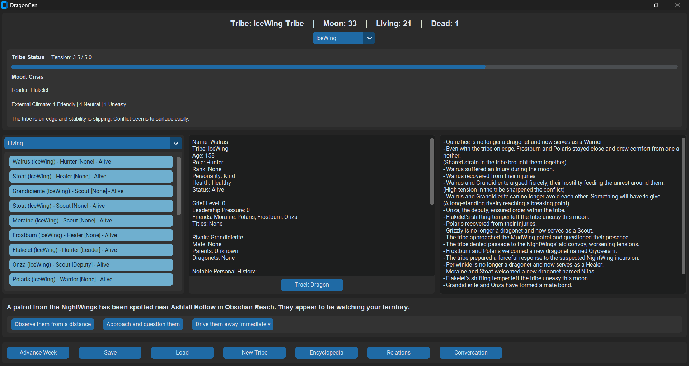
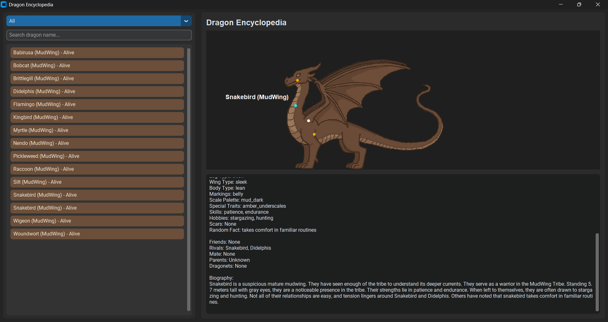
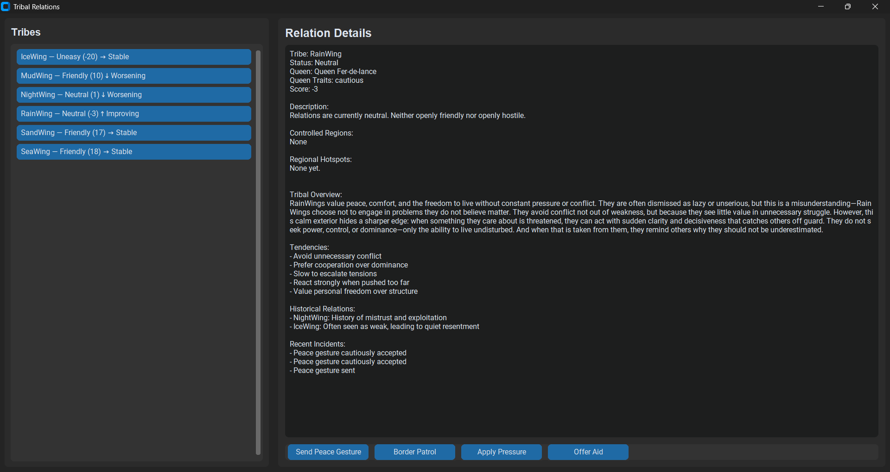

# 🐉 DragonGen






**DragonGen** is a procedural narrative simulation engine inspired by the *Wings of Fire* universe.

It generates living dragon societies—complete with personalities, relationships, and evolving histories—where choices have lasting consequences.

This is not a scripted story.  
This is a world that remembers.

---

## 🔥 Core Concept

DragonGen is built on one principle:

> Actions create memory. Memory shapes the future.

Events don’t reset. They persist.

Dragons remember:
- who helped them
- who betrayed them
- what they lost

And those memories directly influence future outcomes.

---

## 🎮 What You Can Do

- Generate a dynamic tribe of dragons
- Watch relationships form (friends, rivals, family)
- Experience procedurally generated events
- Make decisions during key moments
- See long-term consequences play out over time

---

## ⚖️ Example

A simple event:

> Two dragons are on patrol.  
> One is injured.  
> Enemies are approaching.

You choose to leave.

Later:
- the injured dragon survives
- another tribe finds them
- they return… changed

That decision is not forgotten.

---

## 🧠 Key Systems

### Memory System
Events persist and influence:
- relationships
- dialogue
- future decisions

### Character System
Each dragon has:
- personality traits
- relationships
- evolving history

### Event System
- Weighted outcomes
- Mood-aware narrative (calm vs crisis)
- Player choice at critical moments

### Leadership & Tension
- Leadership decisions affect tribe stability
- Internal and external conflict systems

---

## 🗂️ Project Structure
DragonGen/
core/ → simulation logic
data/ → tribes, personalities, world data
ui/ → interface and display
sim/ → modular systems (events, injuries, leadership, etc.)


Full structure available in the repository.

---

## 🚀 Getting Started

```bash
git clone https://github.com/Jeanedb/DragonGen.git
cd DragonGen
pip install -r requirements.txt
python main.py

🧭 Development Direction

DragonGen is evolving into a living narrative engine, not just a simulator.

Focus areas:

meaningful player decisions
persistent world state
emergent storytelling
logical cause-and-effect systems
🛠️ Roadmap
In Progress
Expanded tribe interactions and relations
Deeper event variety and narrative weight
UI improvements and navigation systems
Planned
Kingdom / location system (palace, hatchery, training grounds, etc.)
Rumor system affecting decisions and events
War and diplomacy systems
Family trees and lineage tracking
Hybrid dragons and genetics
Character-specific event histories
Modular sprite system
⚠️ Current State
Some systems are incomplete or experimental
UI is functional but not final
Balance and event depth are still being developed

This is an active build.

🎯 Vision

Most simulations track numbers.

DragonGen tracks stories.

The goal is a system where:

the world feels alive
characters feel remembered
outcomes feel meaningful
🤝 Contributing

If you're interested in:

simulation systems
procedural storytelling
game design

Contributions and feedback are welcome.

📌 Final Note

This project is early—but intentional.

If you're looking for a finished game, this isn’t it.
If you’re interested in watching a world engine take shape, you’re in the right place.